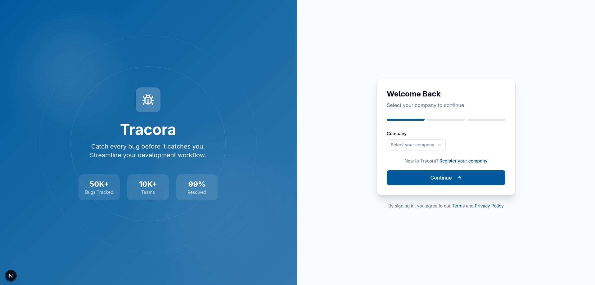
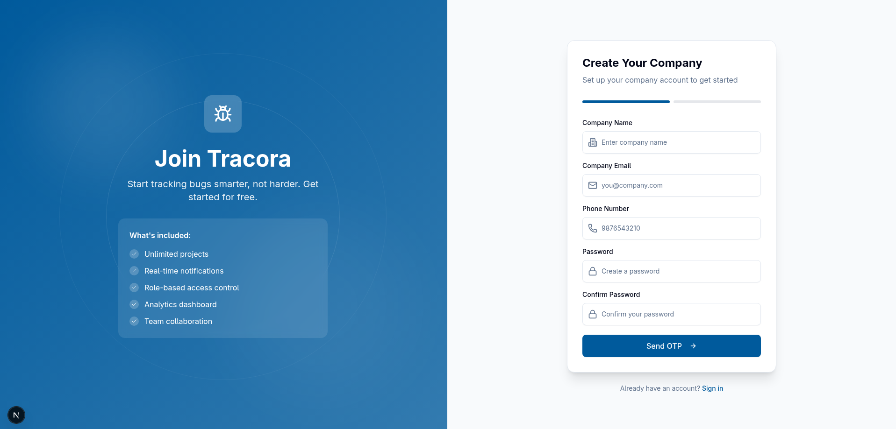
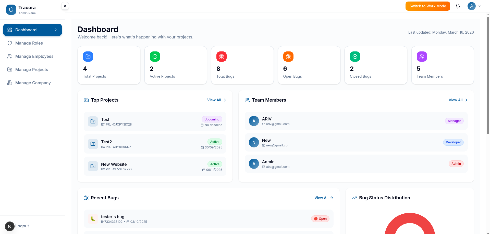
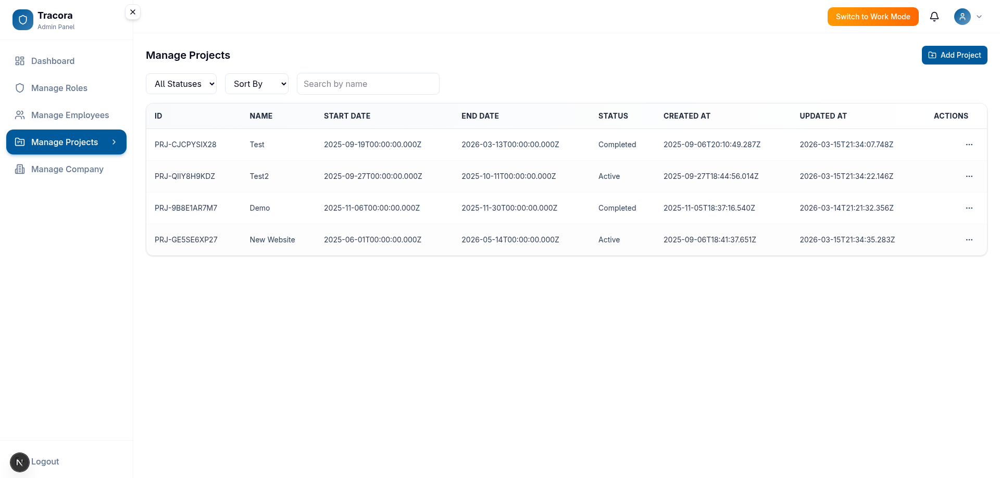
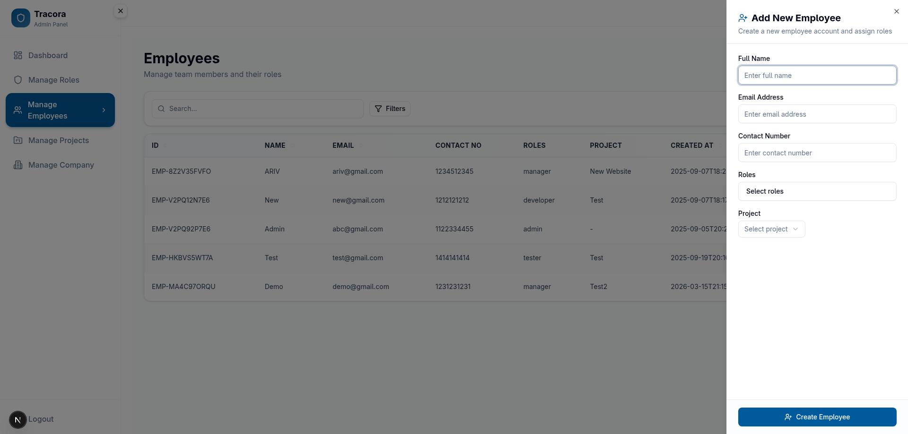
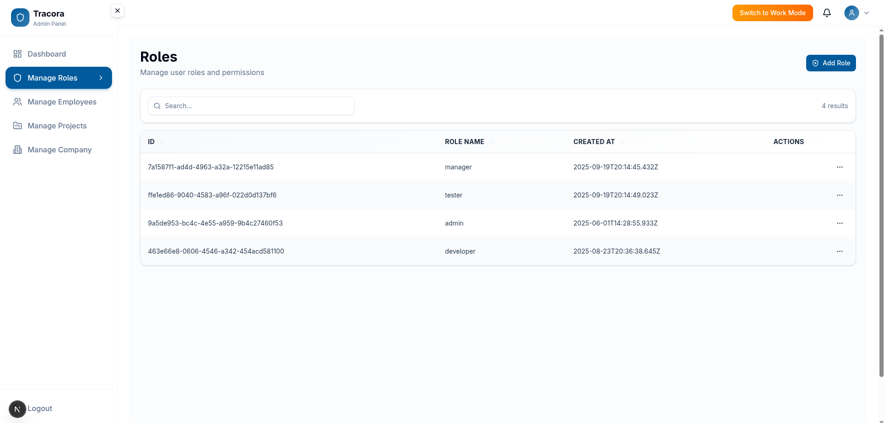
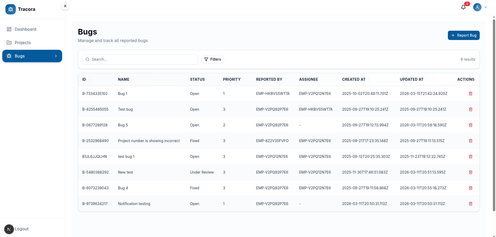
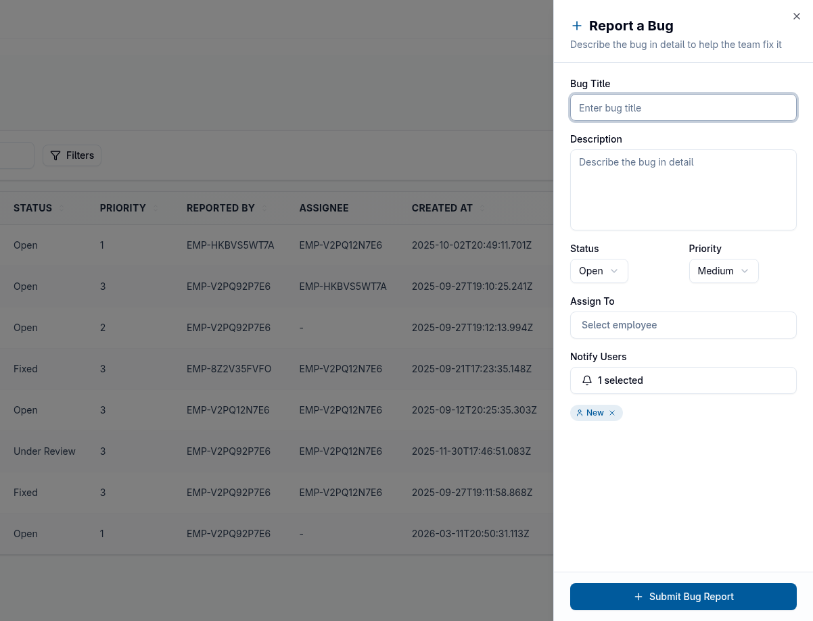
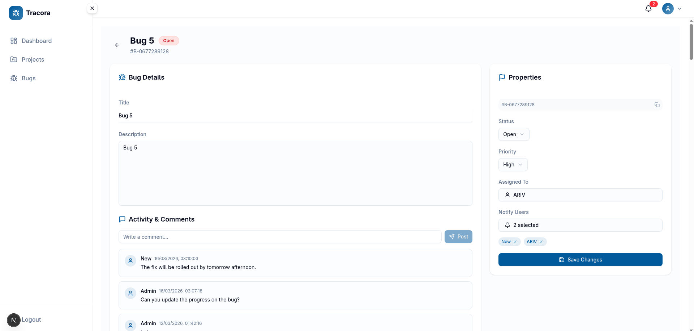
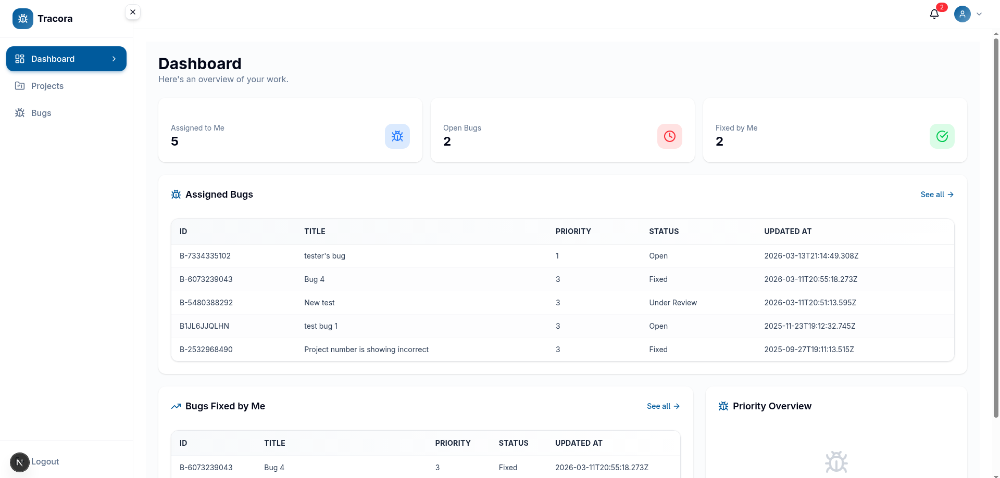

# 🐞 Tracora — Enterprise Bug Tracking System

<p align="center">
  
  
  
</p>

---

## 📋 Table of Contents

1. [Project Overview](#project-overview)
2. [Key Features](#key-features)
3. [Architecture & Tech Stack](#architecture--tech-stack)
4. [Database Schema](#database-schema)
5. [API Endpoints](#api-endpoints)
6. [Authentication & Authorization](#authentication--authorization)
7. [Project Structure](#project-structure)
8. [Getting Started](#getting-started)
9. [Screenshots (Placeholders)](#screenshots-placeholders)
10. [What I Learned](#what-i-learned)
11. [Future Improvements](#future-improvements)

---

## 🎯 Project Overview

Tracora is a **full-stack, multi-tenant bug tracking system** designed for software development teams. It enables organizations to manage projects, track bugs, assign tasks, and collaborate in real-time.

### Why I Built This
- To understand **enterprise-grade application architecture**
- To implement **role-based access control (RBAC)** at scale
- To learn **real-time communication** using WebSockets and SSE
- To handle **async event processing** with Apache Kafka

---

## ✨ Key Features

### 1. Multi-Tenant Architecture
- Each company has isolated data (projects, employees, bugs, roles)
- Company-specific role creation (admin, manager, developer, tester)
- Dashboard and stats filtered by company

### 2. Role-Based Access Control (RBAC)
| Role | Permissions |
|------|-------------|
| **Admin** | Full access: Create/Edit/Delete projects, employees, roles |
| **Manager** | View all projects, manage bugs |
| **Developer** | View assigned projects, update assigned bugs |
| **Tester** | Report bugs, view reported bugs |

### 3. Bug Lifecycle Management
- Create bugs with priority (Critical, High, Medium, Low, Trivial)
- Assign bugs to developers
- Track status: Open → Under Review → Fixed → Closed
- Real-time notifications on status changes

### 4. Authentication & Security
- JWT-based authentication with HTTP-only cookies
- OTP verification for company registration and login
- Password hashing (bcrypt)
- Protected routes with middleware

### 5. Real-Time Features
- **Server-Sent Events (SSE)** for live notifications
- **WebSocket** integration for instant updates
- **Kafka** for async event processing (bug creation, status changes)

### 6. Dashboard Analytics
- Project statistics (total, active, completed)
- Bug statistics (total, open, closed by priority)
- Recent projects, employees, and bugs

---

## 🏗️ Architecture & Tech Stack

### Frontend
- **Next.js 15** — React framework with App Router
- **TypeScript** — Type safety
- **TailwindCSS + shadcn/ui** — Modern, accessible UI components
- **React Hook Form + Zod** — Form validation
- **Recharts** — Data visualization

### Backend
- **Node.js + Express** — API server
- **TypeScript** — Type safety
- **MongoDB + Mongoose** — Database and ODM

### Real-Time & Events
- **WebSocket** — Bi-directional communication
- **Server-Sent Events (SSE)** — Push notifications
- **Apache Kafka** — Event-driven architecture

### Additional Tools
- **JWT** — Token-based auth
- **UUID** — Unique ID generation
- **Cookie Parser** — Session management

---

## 🗃️ Database Schema

```
Company (company_id, name, email, phone, password)
├── Employee (employee_id, name, email, contact, roleId[], projectId)
│   ├── Role (role_id, name, company_id, is_admin, is_default)
│   └── Project (project_id, name, description, start_date, end_date, status)
│       └── Bug (bug_id, name, description, status, priority, reported_by, assigned_to)
│           ├── Comment (comment_id, text, author, timestamp)
│           └── Notification (notification_id, user, message, read)
```

### Key Schema Highlights:

- **Roles** are scoped per company (unique constraint: role_name + company_id)
- **Employees** have unique email/mobile per company (not globally)
- **Projects & Bugs** are filtered by company_id
- **Admin role** is protected (non-editable, non-deletable)

---

## 🌐 API Endpoints

### Authentication
| Method | Endpoint | Description |
|--------|----------|-------------|
| POST | `/auth/registerCompany` | Register new company |
| POST | `/auth/company/verify` | Verify OTP and create company |
| POST | `/auth/login` | Login with email + mobile |
| POST | `/auth/logout` | Logout |
| GET | `/auth/me` | Get current user info |

### Projects (Admin)
| Method | Endpoint | Description |
|--------|----------|-------------|
| GET | `/admin/get-projects` | Get all projects |
| POST | `/admin/createProject` | Create project |
| PUT | `/admin/project/:id` | Update project |
| DELETE | `/admin/project/:id` | Delete project |

### Projects (User)
| Method | Endpoint | Description |
|--------|----------|-------------|
| GET | `/projects/get-projects` | Get accessible projects |

### Bugs
| Method | Endpoint | Description |
|--------|----------|-------------|
| GET | `/bug` | Get all bugs |
| POST | `/bug` | Create bug |
| PUT | `/bug/:id` | Update bug |
| DELETE | `/bug/:id` | Delete bug |

### Employees
| Method | Endpoint | Description |
|--------|----------|-------------|
| GET | `/admin/getAllEmployees` | Get all employees |
| POST | `/admin/createEmployee` | Create employee |
| PUT | `/admin/employee/:id` | Update employee |
| DELETE | `/admin/employee/:id` | Delete employee |
| GET | `/employee/getAssignees` | Get all employees for assignment |

### Roles
| Method | Endpoint | Description |
|--------|----------|-------------|
| GET | `/admin/getRoles` | Get company roles |
| POST | `/admin/createRole` | Create role |
| PUT | `/admin/role/:id` | Update role |
| DELETE | `/admin/role/:id` | Delete role |

### Dashboard
| Method | Endpoint | Description |
|--------|----------|-------------|
| GET | `/admin/stats` | Admin dashboard stats |
| GET | `/admin/stats/employees` | Recent employees |
| GET | `/admin/stats/projects` | Recent projects |
| GET | `/admin/stats/buglist` | Recent bugs |

### Comments & Notifications
| Method | Endpoint | Description |
|--------|----------|-------------|
| GET/POST | `/comment/:bugId` | Get/Add comments |
| GET | `/notification` | Get notifications |
| GET | `/sse/stream` | SSE for real-time updates |

---

## 🔐 Authentication & Authorization

### Authentication Flow
1. **Company Registration** → OTP verification → Admin employee auto-created
2. **Login** → Email + Mobile validation → JWT token in HTTP-only cookie
3. **Protected Routes** → Middleware validates token → Adds user to request

### Authorization Flow
```
User Login → Token contains (employee_id, company_id, role)
     ↓
Middleware extracts company_id from token
     ↓
Role checked via authorizeRole middleware
     ↓
Admin: Full CRUD on all resources
Non-Admin: Read-only on projects, CRUD on own bugs
```

### Security Implementation
- JWT stored in HTTP-only cookies (not localStorage)
- Role-based route protection on backend
- Company-scoped data queries (all queries filter by company_id)
- Protected admin routes (only "admin" role can access)

---

## 📁 Project Structure

```
Tracora/
├── apps/
│   ├── client/                 # Next.js frontend
│   │   ├── src/
│   │   │   ├── actions/       # Server action handlers
│   │   │   ├── app/           # App router pages
│   │   │   ├── components/    # React components
│   │   │   ├── schemas/       # Zod validation schemas
│   │   │   ├── services/      # API service functions
│   │   │   └── lib/           # Utilities
│   │   └── package.json
│   │
│   └── server/                # Express.js backend
│       ├── src/
│       │   ├── config/        # DB, Kafka, WebSocket configs
│       │   ├── controllers/   # Request handlers
│       │   ├── models/       # Mongoose schemas
│       │   ├── routes/        # Express routes
│       │   ├── services/      # Business logic
│       │   ├── middlewares/   # Auth, error handling
│       │   └── utils/         # Helpers
│       └── package.json
│
├── package.json               # Root workspace config
└── README.md
```

---

## 🚀 Getting Started

### Prerequisites
- Node.js 18+
- MongoDB (local or Atlas)
- Kafka (optional, for events)

### Installation

```bash
# Clone repository
git clone https://github.com/AnanyaaKoundal/Tracora.git
cd Tracora

# Install all dependencies
npm install
# or
yarn install
```

### Environment Variables

Create `apps/server/.env`:
```env
PORT=5000
MONGO_URI=mongodb://localhost:27017/tracora
JWT_SECRET=your_super_secret_key
NODE_ENV=development

# Optional (Kafka)
KAFKA_BROKER=localhost:9092
```

### Running the App

```bash
# Start backend (from apps/server)
npm run dev

# Start frontend (from apps/client)
npm run dev
```

Visit **http://localhost:3000**

---

## 📸 Screenshots

### 1. Login Page


### 2. Company Selection


### 3. Admin Dashboard


### 4. Projects Management (Admin)


### 5. Add Employee Modal


### 6. Roles Management


### 7. Bug List Page


### 8. Create Bug Form


### 9. Bug Details with Comments


### 10. Non-Admin User Dashboard



---

## 💡 What I Learned

### Technical Skills
- **Multi-tenancy** — Implementing company-scoped data isolation
- **RBAC** — Role-based access control at database and API level
- **Real-time communication** — WebSockets, SSE, and Kafka integration
- **Authentication** — JWT, HTTP-only cookies, OTP flow
- **TypeScript** — Type safety across frontend and backend

### System Design
- **Database modeling** — Schema design with proper indexing and constraints
- **API design** — RESTful patterns, error handling, validation
- **Security** — Protecting sensitive routes and data

### Best Practices
- **Code organization** — Modular, maintainable structure
- **Error handling** — Consistent error responses
- **Validation** — Zod schemas for type-safe validation

---

## 🔮 Future Improvements

- [ ] Email notifications
- [ ] File attachments for bugs
- [ ] Slack/Discord integration
- [ ] Advanced analytics
- [ ] Mobile app (React Native/Flutter)
- [ ] CI/CD integration

---

## 📄 License

MIT License — feel free to use this project for learning and portfolio purposes.

---

## 🙋‍♂️ Connect

- **GitHub**: [AnanyaaKoundal](https://github.com/AnanyaaKoundal)
- **LinkedIn**: [Ananyaa Koundal](https://linkedin.com/in/ananyaakoundal)

If you use this project, ⭐ the repo and share your feedback!