<p align="center">
  
</p>

<h1 align="center">Tracora</h1>

A multi-tenant bug tracker where **every query is tenant-scoped**, bug events fan out
through **Kafka → WebSocket**, and an in-app **AI assistant** answers questions about
your bugs with **clickable citations**: every id it quotes came from a tool that
returned it.

<p align="center">
  
  
  
  
  
  
  
  
</p>

---

## The two guarantees

Two properties the rest of the code is written around.

**1. Data never crosses a tenant.**
`company_id` is taken from the verified JWT and is part of *every* id-addressed query.
Another company's bug, project, role or employee is a `404`, never a `403`: a `403`
confirms the record exists. An admin of company A asking for company B's record
gets the same answer as asking for a record nobody ever created.

**2. The assistant never invents an id.**
Before a reply is shown, every id in it is checked against the records the tools
returned for this tenant. Citations are built from those same records, so a
cited id is by construction one the model saw.

---

## Tech stack

| Layer | Choice |
|---|---|
| Client | Next.js 15 (App Router) · React 19 · TypeScript · Tailwind + shadcn/ui · React Hook Form + Zod · Recharts · Zustand · react-markdown |
| API | Node.js · Express 5 · TypeScript · Mongoose |
| Assistant service | FastAPI · Pydantic · httpx · hand-rolled provider adapter over **Ollama / Groq / Hugging Face / OpenAI** (no vendor SDK lock-in) |
| Events | Kafka via KafkaJS · 4 topics, one consumer group |
| Realtime | WebSocket (`ws://…/ws`), shared with the API server |
| Vector search | Qdrant (`tracora_entities`) + Ollama `nomic-embed-text` |
| Auth | JWT in an HTTP-only cookie · bcrypt · OTP via Resend |
| Tests | pytest (104) · graded eval suite (41 cases) · see [Tests & evals](#tests--evals) |

---

## System at a glance

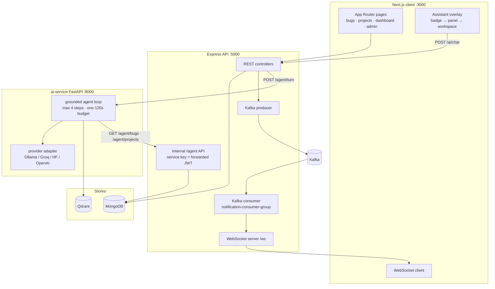
```mermaid
graph TB
    subgraph client ["Next.js client :3000"]
        UI["App Router pages<br/>bugs · projects · dashboard · admin"]
        ASST["Assistant overlay<br/>badge → panel → workspace"]
        WSCLIENT["WebSocket client"]
    end

    subgraph api ["Express API :5000"]
        REST["REST controllers"]
        INTERNAL["Internal /agent API<br/>service key + forwarded JWT"]
        WSSERVER["WebSocket server /ws"]
        PRODUCER["Kafka producer"]
        CONSUMER["Kafka consumer<br/>notification-consumer-group"]
    end

    subgraph agent ["ai-service FastAPI :8000"]
        LOOP["grounded agent loop<br/>max 4 steps · one 120s budget"]
        ADAPTER["provider adapter<br/>Ollama / Groq / HF / OpenAI"]
    end

    subgraph data ["Stores"]
        MONGO[("MongoDB")]
        QDRANT[("Qdrant")]
    end

    KAFKA[("Kafka")]

    UI --> REST
    ASST -->|"POST /ai/chat"| REST
    REST --> MONGO
    REST --> PRODUCER --> KAFKA
    KAFKA --> CONSUMER --> WSSERVER --> WSCLIENT
    REST -->|"POST /agent/turn"| LOOP
    LOOP --> ADAPTER
    LOOP --> QDRANT
    LOOP -->|"GET /agent/bugs · /agent/projects"| INTERNAL
    INTERNAL --> MONGO
```

The assistant service **never opens a database connection** for a live request: it asks
Express over an internal, key-protected endpoint, and Express applies the tenant filter
that came in on the user's forwarded JWT.

---

## What's in it

### 1. Multi-tenant + RBAC

- Every company's projects, employees, roles and bugs are isolated by `company_id`
- Four built-in roles (admin, manager, developer, tester) plus company-defined roles;
  `is_admin` is server-assigned, so an edit body can't grant it to itself
- Tenant and identity fields (`company_id`, `*_id`, `is_admin`, `is_default`) are
  stripped from update payloads: no moving a record between companies, no self-promotion
- Unauthenticated requests are rejected before scoping: a token that omits `company_id`
  would otherwise *widen* a Mongoose filter to every tenant, so it is refused outright

### 2. Bug lifecycle

- Priority (Critical → Trivial), assignment, and status: Open → Under Review → Fixed → Closed
- Project assignment is re-validated on create **and** on edit, so a bug can't be moved
  into another tenant's project
- Comments with tagging/seen-state, dashboard analytics per role

### 3. Real-time fan-out

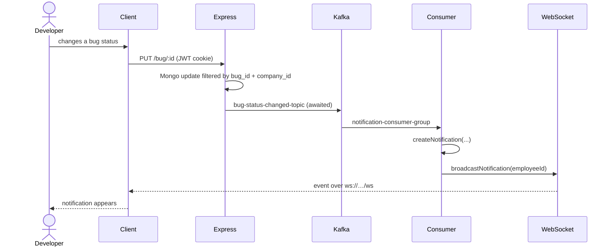
```mermaid
sequenceDiagram
    actor U as Developer
    participant C as Client
    participant E as Express
    participant K as Kafka
    participant N as Consumer
    participant W as WebSocket

    U->>C: changes a bug status
    C->>E: PUT /bug/:id (JWT cookie)
    E->>E: Mongo update filtered by bug_id + company_id
    E->>K: bug-status-changed-topic (awaited)
    K->>N: notification-consumer-group
    N->>N: createNotification(...)
    N->>W: broadcastNotification(employeeId)
    W-->>C: event over ws://…/ws
    C-->>U: notification appears
```

Topics: `bug-created-topic`, `bug-status-changed-topic`, `bug-assigned-topic`,
`comment-topic`. The produce is **awaited**, so a bug write requires a running broker:
Kafka is a dependency of this project, not an optional extra.

### 4. In-app AI assistant

Ask questions in plain English, in the app, on whatever page you're on:

> *"which open bugs are critical?"* → the agent searches, answers in prose, and lists
> `B1JL6JJQLHN` as a clickable **Source**: each id was returned by a tool
> scoped to your company.

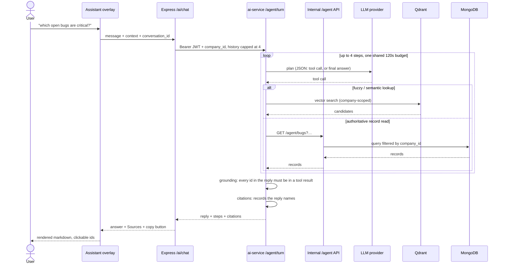
```mermaid
sequenceDiagram
    actor U as User
    participant O as Assistant overlay
    participant X as Express /ai/chat
    participant A as ai-service /agent/turn
    participant T as Internal /agent API
    participant L as LLM provider
    participant Q as Qdrant
    participant M as MongoDB

    U->>O: "which open bugs are critical?"
    O->>X: message + context + conversation_id
    X->>A: Bearer JWT + company_id, history capped at 4
    loop up to 4 steps, one shared 120s budget
        A->>L: plan (JSON: tool call, or final answer)
        L-->>A: tool call
        alt fuzzy / semantic lookup
            A->>Q: vector search (company-scoped)
            Q-->>A: candidates
        else authoritative record read
            A->>T: GET /agent/bugs?…
            T->>M: query filtered by company_id
            M-->>T: records
            T-->>A: records
        end
    end
    A->>A: grounding: every id in the reply must be in a tool result
    A->>A: citations: records the reply names
    A-->>X: reply + steps + citations
    X-->>O: answer + Sources + copy button
    O-->>U: rendered markdown, clickable ids
```

Progress is shown as steps while the agent works; the answer then arrives as one
complete, grounded message with its Sources and a copy button. The assistant has no
write path, so a prompt injection has nothing to pull on. Full rules, tool contract and
failure handling live in [`docs/AI-ASSISTANT.md`](docs/AI-ASSISTANT.md).

---

## Decisions & what they cost

| Decision | Why, and what it cost |
|---|---|
| **Express owns every Mongo read** | The assistant service is stateless w.r.t. your data. Cost: an extra hop per tool call, plus an internal key to protect. |
| **Grounding checks the reply *text*, not a provider's `tool_calls` field** | Works on any backend, including ones with no structured tool-calling. Cost: string matching instead of exact structure. |
| **The tenant filter lives *inside* the query, not after it** | "Not found" and "not visible" become the same `404`, so existence is never disclosed. Cost: every id-addressed function takes `company_id` (24 call sites). |
| **No forced retrieval** | The model isn't ordered to search; a guard catches an uncited id and forces one retry, so grounding holds even when the model is confident. |
| **The assistant has no write path** | Search and explain only, which removes the entire mutation surface from a prompt injection. Next: acting tools behind an explicit confirmation step. |
| **One tenant boundary, enforced in one place** | Tenant isolation is the hard boundary and every handler applies it identically. Role-level scoping layers on top of the same queries later. |
| **Provider-agnostic adapter + a hard paid gate** | Ollama/Groq/HF/OpenAI behind one interface, `llm_allow_paid=false` by default, so no paid API is called unless you flip it. Cost: no vendor-specific features. |
| **Citations come only from tool results** | The model cannot cite a record it never fetched. Cost: a reply with no fetched records shows no sources. |
| **Kafka for fan-out, not in-process emits** | Events outlive the process and are replayable. Cost: a required broker; bug writes fail without it. |
| **Auth before scoping** | Every router declares `Router.use(authenticate)` ahead of its handlers, so a `company_id` from a verified token is always there to scope with, and a token missing it is refused outright. |
| **Server-owned fields stripped from edit bodies** | Prevents tenant moves and `is_admin` self-promotion. Cost: none, the client never needed to send them. |

---

## Tests & evals

| Layer | Covers | How to run |
|---|---|---|
| `ai-service/tests` (104) | grounding, citations, tool contracts, retries/deadlines, config, graders | `python -m pytest` (from `ai-service/`) |
| `ai-service/evals` (41 cases, 10 categories) | graded behaviour against a live model: honesty, scoping, ambiguity, tool use | `python evals/runner.py --live --backend groq` |
| `server` | typecheck | `yarn build` (from `server/`) |
| `client` | lint + typecheck | `yarn lint` |

The eval layer is separate from tests on purpose: a model doesn't return the same string
twice, so equality assertions are useless. Each live run is committed under
`ai-service/evals/baselines/` with its backend, model and prompt hash; pass rates are
quoted from the latest committed run, never from memory.

---

## Run it locally

Three services, a one-off indexer, four dependencies.

```bash
# Dependencies
mongod                                   # MongoDB
docker run -p 6333:6333 qdrant/qdrant    # vector store
# Kafka (single broker), REQUIRED: bug/comment writes await a produce
ollama serve
ollama pull llama3.2 && ollama pull nomic-embed-text

# 1. API (:5000)
cd server && yarn && yarn dev

# 2. Assistant service (:8000)
cd ai-service && pip install -r requirements.txt -r requirements-dev.txt && python run.py

# 3. Vector index (once, after Mongo has data)
cd ai-service && python scripts/reindex.py

# 4. Client (:3000)
cd client && yarn && yarn dev
```

**Environment**: `server/.env` needs `MONGO_URI`, `JWT_SECRET`, `KAFKA_BROKERS`,
`RESEND_API_KEY` (OTP mail) and `NODE_ENV` (optional `PORT`, defaults to 5000).
For `ai-service/.env`: `llm_backend`, `llm_fallback_order`, `groq_api_key` / `hf_token` /
`openai_api_key`, `llm_allow_paid`, `ollama_host`, `qdrant_url`, `express_base_url`,
`internal_api_key`. Defaults in `ai-service/app/config.py` are enough for local dev.

---

## Screenshots

| | |
|:-:|:-:|
| 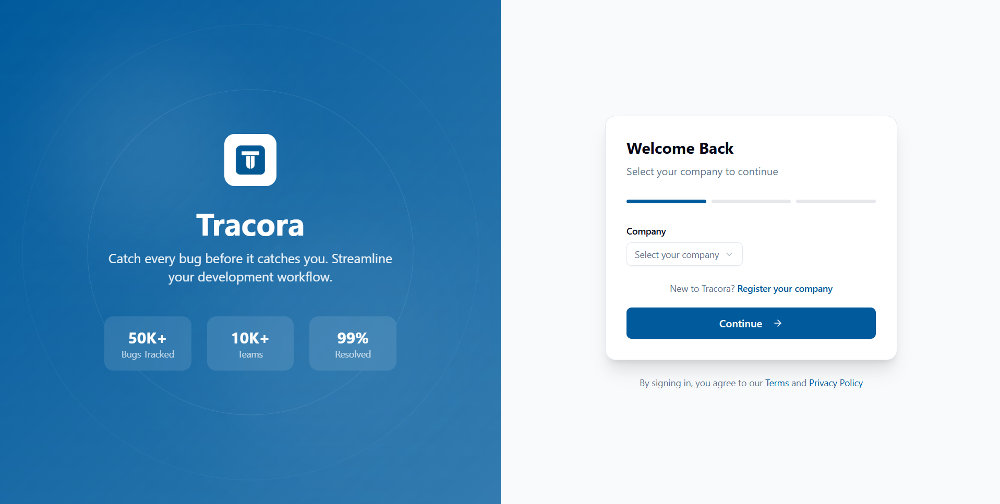<br/><sub>**Login**</sub> | 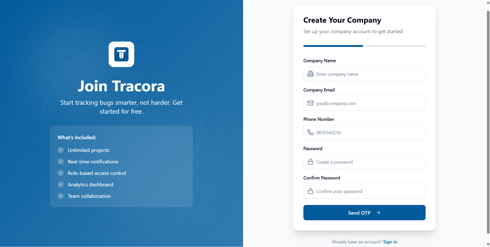<br/><sub>**Company registration**</sub> |
| 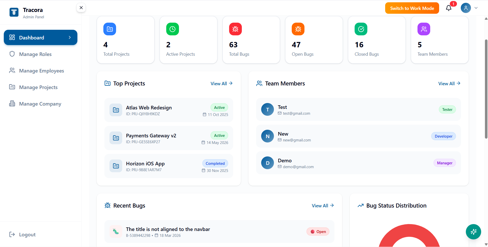<br/><sub>**Admin dashboard**</sub> | 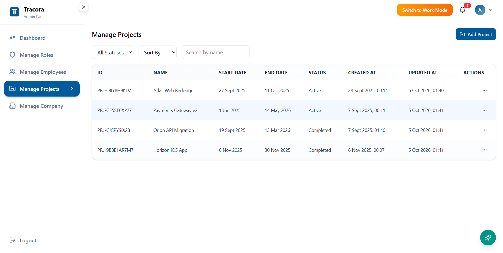<br/><sub>**Projects management**</sub> |
| 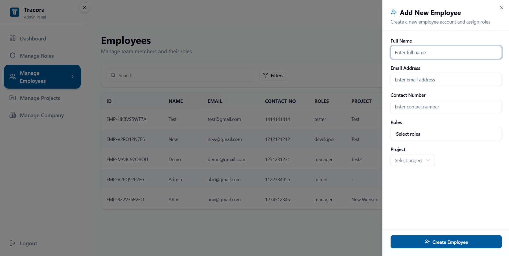<br/><sub>**Add employee**</sub> | 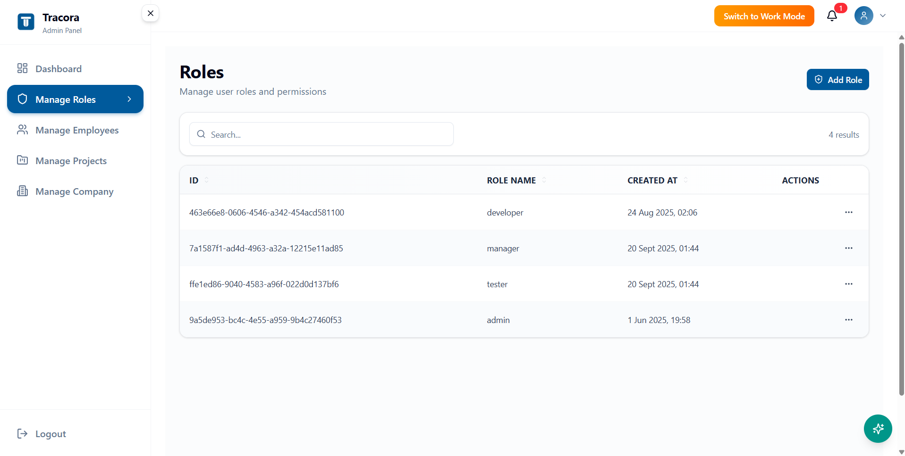<br/><sub>**Roles & permissions**</sub> |
| 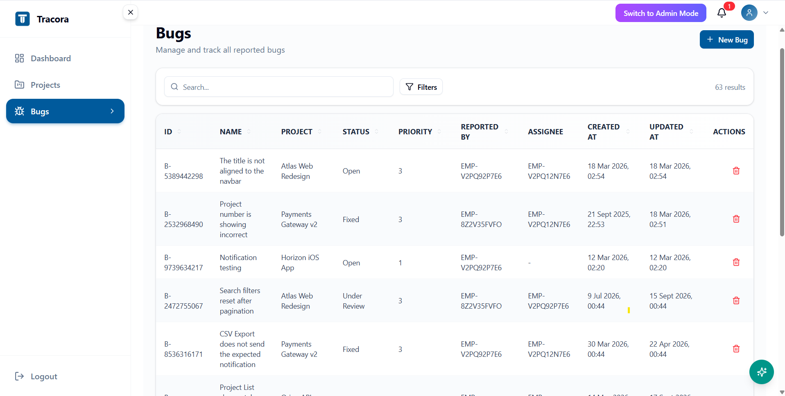<br/><sub>**Bug list**</sub> | 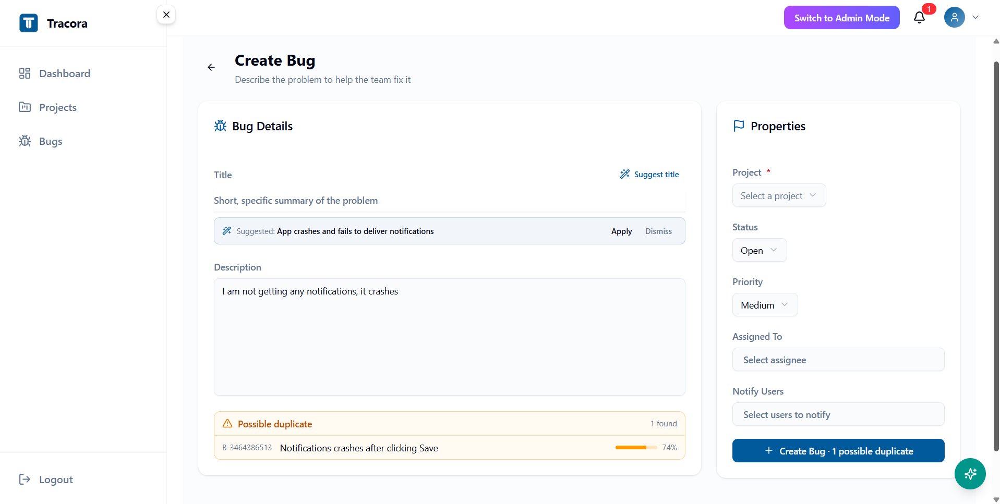<br/><sub>**Create bug**</sub> |
| 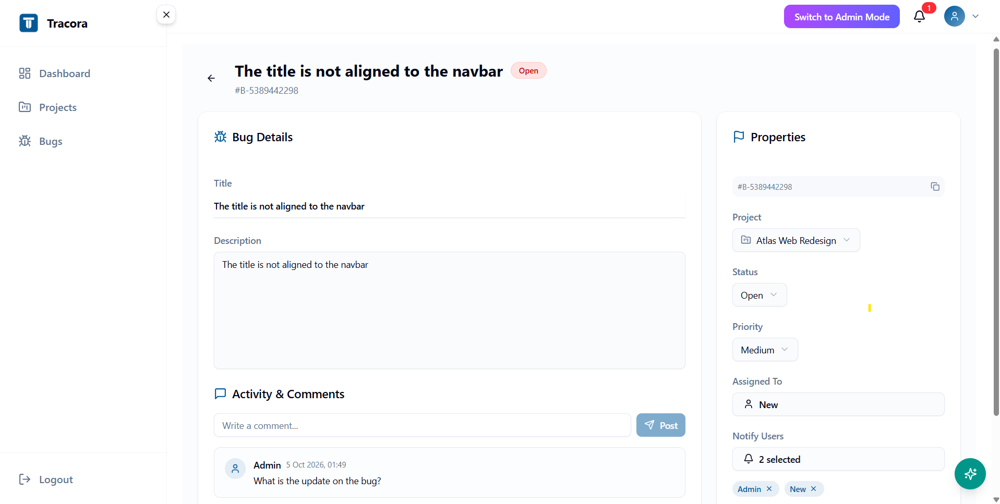<br/><sub>**Bug details + comments**</sub> | 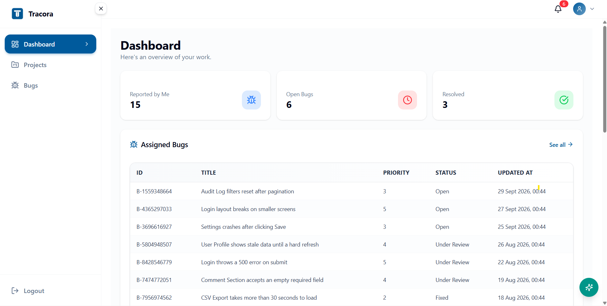<br/><sub>**Non-admin dashboard**</sub> |
| 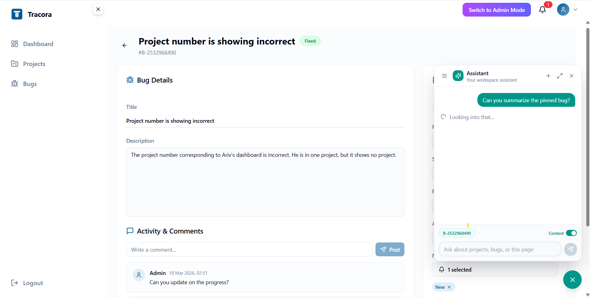<br/><sub>**AI assistant (panel)**</sub> | 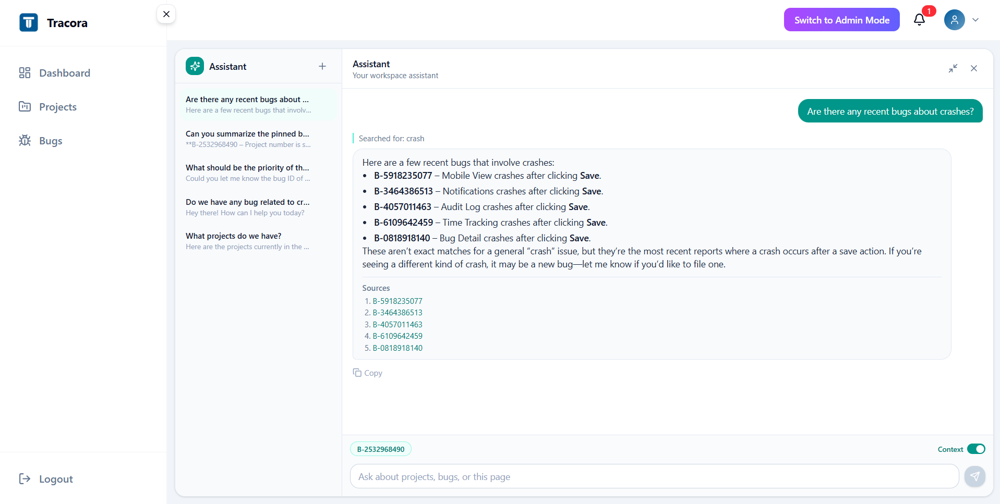<br/><sub>**AI assistant (fullscreen)**</sub> |

---

## Project layout

```
Tracora/
├── client/          Next.js 15 · pages, assistant overlay, WebSocket client
├── server/          Express 5 · REST, auth, Kafka producer/consumer, WebSocket
│   ├── src/config/      db, kafka, websocket
│   ├── src/controllers/ request handlers
│   ├── src/services/    business logic (tenant-scoped queries live here)
│   ├── src/models/      Mongoose schemas
│   └── src/routes/      mounts + authenticate/authorizeRole
├── ai-service/      FastAPI · grounded agent loop, provider adapter, evals
│   ├── app/             main + config entrypoints
│   ├── app/routers/     agent, bugs, health endpoints
│   ├── app/domains/     agent loop, bugs, projects
│   ├── app/core/        llm (providers/chat), vector (qdrant), Express data client, logging
│   ├── app/models/      Pydantic schemas
│   ├── evals/           41 graded cases + committed baselines
│   └── tests/           104 unit tests
└── docs/            AI-ASSISTANT.md (assistant depth), API.md (routes), screenshots/
```

Route-by-route reference: [`docs/API.md`](docs/API.md). Assistant rules, tool contract
and eval method: [`docs/AI-ASSISTANT.md`](docs/AI-ASSISTANT.md).

---

## What's next

- **Feedback → eval cases**: thumbs-down captures the exchange as a new eval case, so
  every complaint becomes a regression test
- **Acting tools**: file-the-bug-for-me, behind an explicit confirmation step
- **Field-level role policy**: a developer should not read bugs assigned to other people
- **Token/cost readout** per assistant turn
- **Per-category eval dashboard** with a dated pass-rate history

---

## License

MIT, for learning and portfolio use.

## Connect

- **GitHub**: [AnanyaaKoundal](https://github.com/AnanyaaKoundal)
- **LinkedIn**: [Ananyaa Koundal](https://linkedin.com/in/ananyaakoundal)

If this was useful, ⭐ the repo and tell me what broke.
